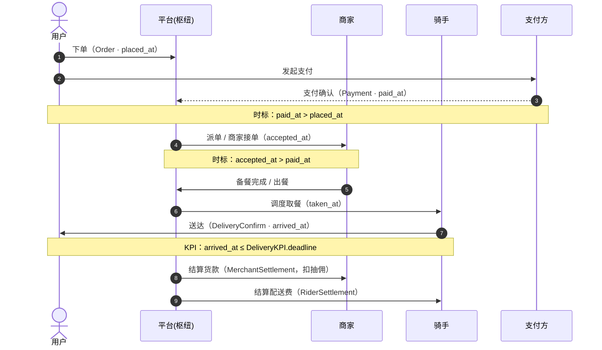
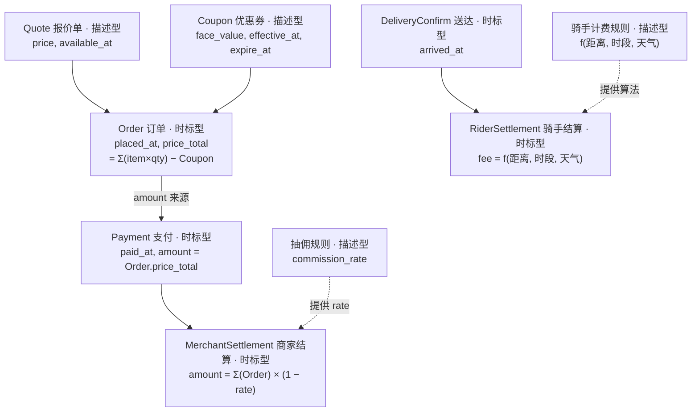
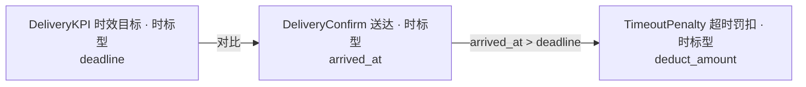
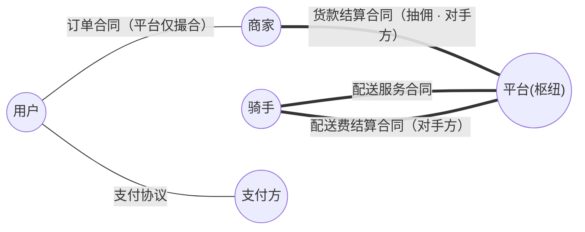
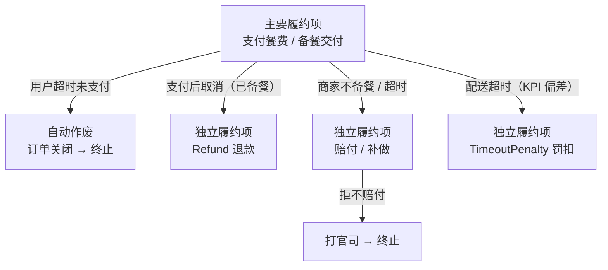
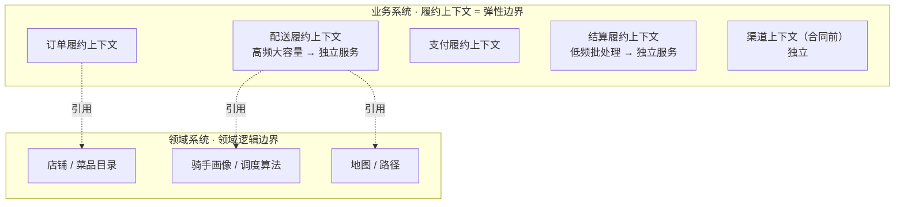

# 外卖平台业务建模方案（双 skill 实测产出）

> **用途**：核查 `bm-four-color` 与 `bm-8x-flow` 两个 skill 的实际产出质量。
> **场景**：外卖平台（类似美团 / 饿了么）——用户下单点餐、在线支付；商家接单备餐；骑手取餐配送送达；平台向商家结算货款（抽佣）、向骑手结算配送费；存在超时、取消、退款。
> **生成方式**：fresh agent 严格按迭代后的 SKILL.md + `reference/` 独立产出（不依赖作者意图、不读原文）。
> **查看**：含 Mermaid 流程图 / 时序图，支持 Mermaid 渲染的查看器（Claude Code、GitHub、VS Code）可直接看图。
> **核查重点**：① 业务模型（凭证链 / 合同 / 履约 / 变化点）是否符合外卖真实业务；② 卡点是否真解决。

---

## 0. 概览：端到端业务时序

凭证随业务推进依次产生，箭头数字为时序步骤，注释标注关键时标约束。

---

## 一、四色建模产出（bm-four-color）

### 1.1 入口识别

| # | 入口 | 类型 | 性质 |
|---|---|---|---|
| 1 | 用户在线支付餐费 | 现金（平台代收→拆付商家） | 收入流 |
| 2 | 平台向商家结算货款（扣抽佣） | 现金支出 | 收入流 |
| 3 | 平台向骑手结算配送费 | 现金支出 | 收入流 |
| 4 | 配送时效 | 无直接现金往来 | KPI（成本结构） |

### 1.2 业务脊梁（凭证链图 + 凭证表）

凭证间的追溯关系（实线 = 数值/时标来源，虚线 = 规则来源）：

| 凭证 | 原型 | 关键数据项 | 来源 / 计算逻辑 | 时标顺序逻辑 |
|---|---|---|---|---|
| Order 订单 | 时标型 | `placed_at`, `price_total` | `price_total = Σ(MenuItem.snapshot_price × qty) − Coupon.face_value` | `placed_at > Quote.available_at`（报价 14:00 变更，13:59 下单按旧价） |
| Payment 支付 | 时标型 | `paid_at`, `amount` | `amount = Order.price_total` | `paid_at > Order.placed_at` |
| MerchantSettlement 商家结算 | 时标型 | `settled_at`, `amount` | `amount = Σ(Order.price_total) × (1 − commission_rate)`，账期内 | 账期由 `MerchantAgreement.signed_at` 起算 |
| RiderSettlement 骑手结算 | 时标型 | `settled_at`, `fee` | `fee = f(distance, timeslot, weather)`（**算法计算**，追溯 RiderFeeRule） | 账期内 |
| DeliveryConfirm 送达确认 | 时标型 | `arrived_at` | KPI"实际"履约凭证 | `arrived_at > taken_at > accepted_at > paid_at` |
| Refund 退款 | 时标型 | `refund_at`, `amount` | `amount = Payment.amount` | `refund_at > Payment.paid_at`；引用 Payment 作退款依据 |
| TimeoutPenalty 超时罚扣 | 时标型 | `penalty_at`, `deduct_amount` | KPI 偏差触发 | `arrived_at > DeliveryKPI.deadline` 时触发 |
| Quote 报价单 / MenuItem | 描述型 | `price`, `available_at` | 规则模板，被订单引用 | — |
| Coupon 优惠券 | 描述型 | `face_value`, `effective_at`, `expire_at` | 规则模板，被订单引用 | — |
| CommissionRule 抽佣规则 | 描述型 | `rate` | 规则模板 | — |
| RiderFeeRule 骑手计费规则 | 描述型 | 计费算法 | 规则模板 | — |
| 餐品 / 用户 / 商家 / 骑手 / 平台 | 参与者型（PPT） | — | **标的物 = 餐品**，归此类；业务上下文不拥有其生命周期 | — |
| 付款方 / 收款方 / 下单人 / 配送方 | 角色型 | — | 参与方在凭证中的角色 | — |

### 1.3 异常 / 逆向凭证

- **Refund**：`refund_at > paid_at`，`amount = Payment.amount`，引用原支付凭证。
- **Cancel**：状态翻转；若无需对方确认 → 自动作废；若已备餐需赔付 → 独立履约项。
- **TimeoutPenalty**：由 KPI 偏差追溯触发。

### 1.4 KPI 凭证链（配送时效）

偏差追溯：实际 `arrived_at` 与目标 `deadline` 对比，超出则触发 `TimeoutPenalty`（扣款 / 差评等违约凭证）。

### 1.5 四原型分布

| 原型 | 颜色 | 本场景元素 |
|---|---|---|
| 时标型（Moment-Interval） | 红/粉 | Order、Payment、MerchantSettlement、RiderSettlement、DeliveryConfirm、Refund、TimeoutPenalty、DeliveryKPI |
| 描述型（Description） | 蓝 | Quote 报价单、Coupon 优惠券、CommissionRule、RiderFeeRule |
| 角色型（Role） | 黄 | 付款方、收款方、下单人、配送方 |
| 参与者型（Party-Place-Thing） | 绿 | 用户、商家、骑手、平台、**餐品（标的物）** |

### 1.6 关键判别应用

- **骑手配送费**（算法生成金额）→ 关键数据项三类来源的第③类（规则/算法计算），追溯到 `RiderFeeRule`。
- **报价单 / 优惠券**虽带时间戳，但仅被订单引用、承载规则 → **描述型**（非时标型）。
- **餐品**是标的物 → **参与者型（Party-Place-Thing）**。

---

## 二、8X Flow 建模产出（bm-8x-flow）

### 2.1 合同上下文（平台枢纽方判定）

判定规则：识别每个盈利流的**实际收款方 / 付款方** = 结算合同对手方；**只撮合不直接收付** = 支撑方，不进核心合同。

> 实线 `===` = 平台作为对手方直接收付的结算合同（平台盈利来源）；普通线 `---` = 平台不直接收付的合同。

| 盈利流 | 收款方 | 付款方 | 平台角色 | 进核心合同？ |
|---|---|---|---|---|
| 用户付餐费 | 平台（代收）→ 商家（结算） | 用户 | 收付方 | 是 |
| 平台抽佣 | 平台 | 商家 | **对手方** | 是（结算合同） |
| 配送费 | 平台 → 骑手 | 用户/平台 | **对手方** | 是（结算合同） |
| 撮合用户与商家点餐 | — | — | 仅撮合（支撑方） | 否 |

**拆出的双方合同：**

| 合同 | 甲方 | 乙方 | 标的物 |
|---|---|---|---|
| 订单合同 | 用户 | 商家 | 餐品（平台仅撮合） |
| 支付协议 | 用户 | 支付方/平台 | 资金（→ 变化点） |
| 货款结算合同 | 商家 | 平台 | 餐款（含抽佣） |
| 配送服务合同 | 用户/平台 | 骑手 | 配送服务 |
| 配送费结算合同 | 骑手 | 平台 | 配送费 |

### 2.2 主要履约项（以订单合同 用户↔商家 为例）

| 主要履约项 | 权利方 | 义务方 | 履约请求（时间段） | 履约确认（时间点） |
|---|---|---|---|---|
| 支付餐费 | 商家 | 用户 | 下单 → 支付时限 | 支付完成 |
| 备餐并交付 | 用户 | 商家 | 接单 → 出餐时限 | 出餐 / 取餐确认 |

> 主要履约项判定：围绕合同**核心对价 / 核心收入流**的履约项（如订单合同的"支付餐费""提供餐品"）。

### 2.3 违约流转（独立履约项 vs 自动作废）

| 违约场景 | 处理 | 判定依据 |
|---|---|---|
| 用户超时未支付 | 订单关闭 | **自动作废**（状态翻转，无需对方确认）→ 终止 |
| 支付后取消（已备餐） | 退钱 | **独立履约项** Refund（违约方需主动作为） |
| 商家不备餐 / 超时 | 赔付 / 补做 | 独立履约项 → 拒不赔付 → **打官司（终止）** |
| 骑手取餐后未送达 | 骑手 / 平台赔付 | 独立履约项 |
| 配送超时（KPI 维度） | 超时罚扣 | 独立履约项 TimeoutPenalty（KPI 偏差触发） |

### 2.4 变化点

- **支付确认角色化**：由微信 / 支付宝 / 余额 / 货到付款等不同支付合同的凭证扮演同一"支付确认"角色 → 核心订单合同不逐个依赖新支付合同。
- **送达确认角色化**：专送 / 众包 / 商家自配等不同配送合同凭证扮演。
- **抽佣规则**（描述型规则模板）：随运营变化，独立变化点。
- **渠道上下文（合同前）**：RFP（浏览选店）→ Proposal（加购物车）→ 签约（下单），与履约弹性差距大，必须分离。

### 2.5 弹性边界 / 服务映射

- **配送履约**（高频大容量）→ 独立弹性边界 / 独立服务。
- **结算履约**（低频批处理：抽佣、配送费结算）→ 独立边界。
- 支付履约、订单履约分别聚类；渠道上下文独立。
- 依据：**履约上下文 = 弹性边界**（合同上下文 ≠ 弹性边界）。

---

## 三、端到端业务走查（场景化）

把凭证与合同放回真实流程，验证模型能否自洽。

### 3.1 正常下单 → 配送 → 结算

1. 用户下单 → 生成 `Order`（`placed_at`，`price_total` 由报价单/优惠券计算）。
2. 用户支付 → `Payment`（`paid_at > placed_at`，`amount = Order.price_total`）；支付确认由支付协议合同的凭证扮演（变化点）。
3. 商家接单备餐 → 出餐；骑手取餐送达 → `DeliveryConfirm`（`arrived_at`，受 `DeliveryKPI.deadline` 约束）。
4. 账期结算：`MerchantSettlement`（`amount = Σ(Order)×(1−rate)`）、`RiderSettlement`（`fee = f(…)`）。

### 3.2 取消退款（异常）

- 已备餐后用户取消 → 触发独立履约项 `Refund`（`refund_at > paid_at`，`amount = Payment.amount`，引用 Payment 作依据）。
- 未备餐取消 → 订单状态翻转，自动作废，无独立权责项。

### 3.3 配送超时罚扣（KPI 偏差）

- `arrived_at > DeliveryKPI.deadline` → 触发 `TimeoutPenalty`（扣骑手配送费 / 影响结算）→ 进入骑手结算合同的违约处理。

---

## 四、卡点修复核查（第二轮重测结论）

### bm-four-color：6/6 已解决

| 原卡点 | 判定 | 修复依据 |
|---|---|---|
| 标的物归类 | ✅ 已解决 | 参与者型 = Party-Place-Thing（含"物"），标的物归此类 |
| 异常 / 逆向流程 | ✅ 已解决 | 步骤 6 + concepts"异常/逆向凭证"（退款范例） |
| KPI 凭证链 | ✅ 已解决 | 步骤 1 + concepts"KPI 凭证链结构"（配送时效范例） |
| 履约凭证发现（支出侧） | ✅ 已解决 | 步骤 4 + concepts"履约凭证发现规则"（双侧） |
| 算法生成金额 | ✅ 已解决 | 步骤 3 + concepts"关键数据项三类来源"（骑手费范例） |
| 描述型 vs 时标型 | ✅ 已解决 | concepts 四原型判别准则（报价单/优惠券点名） |

### bm-8x-flow：4/4 已解决

| 原卡点 | 判定 | 修复依据 |
|---|---|---|
| 平台 / 枢纽参与方 | ✅ 已解决 | 步骤 1 + concepts"枢纽参与方/平台型业务"（外卖示例） |
| "按四色找凭证"空指针 | ✅ 已解决 | 步骤 2 内联四色最小子步骤（找凭证→列关键项→追溯来源） |
| 主要履约项判定 | ✅ 已解决 | 步骤 2 + concepts"主要履约项 vs 违约履约项" |
| 独立履约项 vs 自动作废 | ✅ 已解决 | 步骤 3 + concepts 同名词条（二分判别） |

---

## 五、剩余缺口（供后续迭代参考，均为非阻断）

1. **多方"代收-拆分"凭证链缺范例**：平台代收用户一笔 Payment，拆付 `MerchantSettlement + RiderSettlement + 平台佣金留存`，这种"一笔收入对应多条支出义务"的拆分计算，四色正文未给范例（可借用 8X 的平台型词条兜底）。
2. **KPI 偏差链的终止条件未说明**：偏差触发扣款凭证后是否继续递归（骑手申诉 → 再触发？），需借 8X 的"打官司"终止条件。
3. **配送动作跨两份合同**：配送（取餐→送达）的对手方是"用户↔骑手"还是"平台↔骑手"未显式说明（实务常拆两份）。
4. **KPI 履约项 vs 合同履约项的升格规则模糊**：配送超时既像合同违约又像 KPI 偏差，何时升格为独立履约项规则不硬。
5. **方法论提示（重要）**：外卖示例与 concepts 给出的平台型示例几乎同构，存在"靠示例类比而非靠规则推导"的风险。建议第三轮换一个 **concepts 未给同构示例的枢纽场景**（如直播打赏、SaaS 分销、广告分润）做交叉验证，以排除水分。
